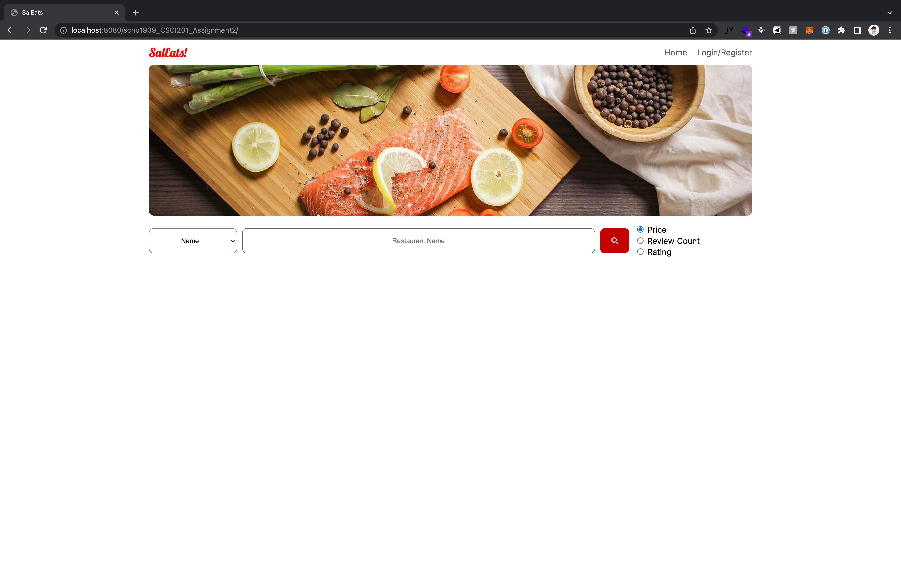
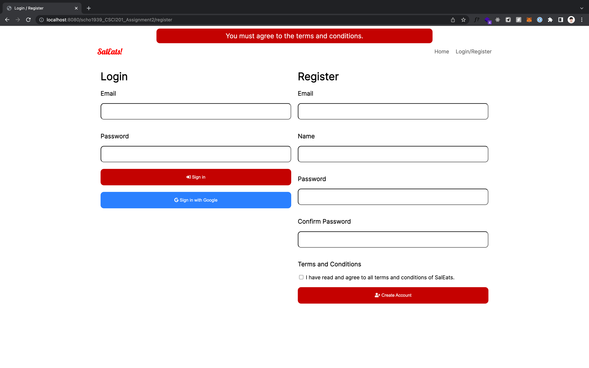
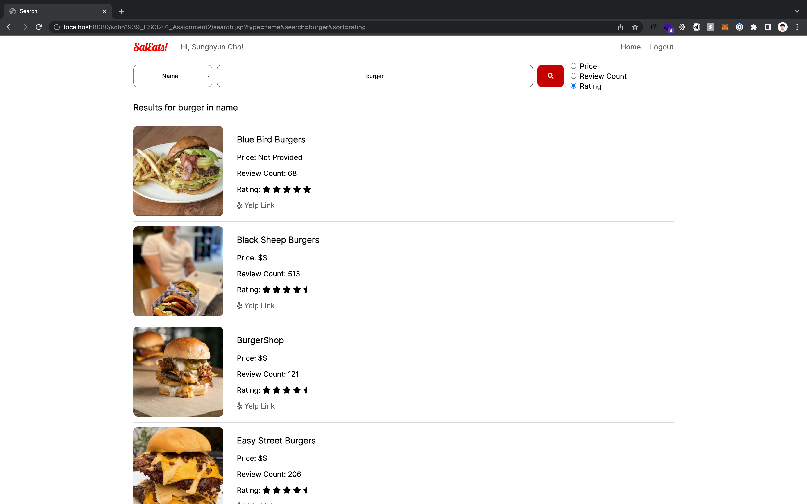
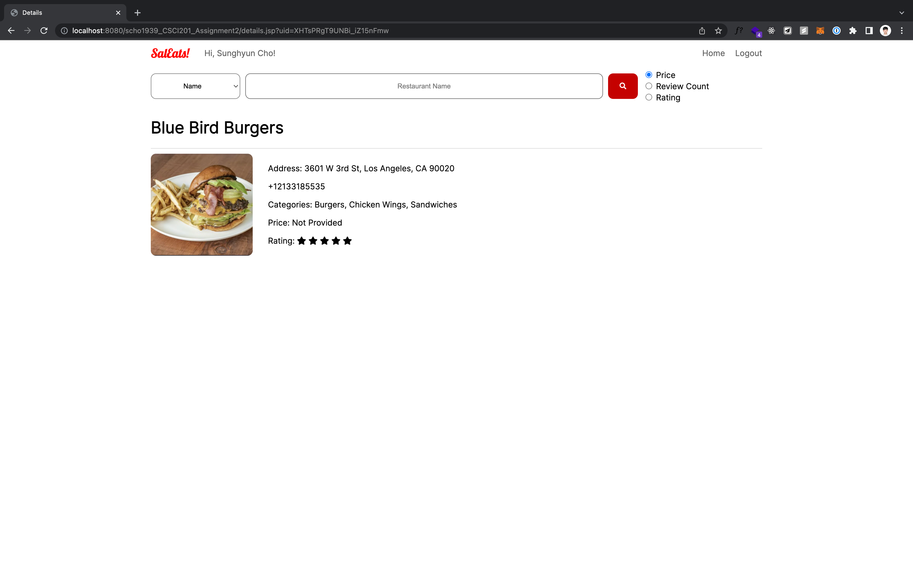

<h1 align="center">SalEats</h1>

## ✉️ Message to future students

Yes, this is that notorious SalEats project. Learning JSPs and Servlets was one of the most useless experience for me; not to mention other frameworks like React.js or Flask, there are better toolkits even for Java such as Maven and Gradle. There is no such point in limiting the tech stack to such outdated architecture.

I value **_breathable_** environment. That means the environment should retain clean and simple yet performant and expressible architecture, where the system amplifies your thoughts, not suffocating you with little details. I hereby open-source my code, as a timid protest to USC never updating such a core class for a decade.

Please look through my code; I have implemented several clean-code patterns, such as:

- **MVC pattern**.
- **Singleton pattern** for Business Logic Layer (`Service.java`) and Database layer (`JdbcDriver.java`).
- **Atomic Design Pattern**. Everything is a component; you change one, the change reflects throughout the website. This separates concerns.
- **Proactive Data Initialization**. Indexing the search data happens only once when the server boots up; not when user attempts to search.
- **Data Transfer Objects**.

You will learn a lot from this codebase, even more so than the regular class. **I also trust your high academic integrity that you will never copy this homework; but copy the essence and good coding practices inside.**

---

## ✉️ Message to professors

Well, if you are to accuse me for open-sourcing this project, that means it's about time to come up with a better homework after 10 years of same homework and finally update the curriculum to reflect modern web development.

---

## ⚡️ Quick start

1. Run the `init.sql` file to create the database.
2. Create an empty workspace on Eclipse.
3. Create a Tomcat 9.0 server.
4. Launch the server on Eclipse.
5. Open the browser and go to [`http://localhost:8080/PROJECT-DIR/`]

## 💽 DB User Info

- Username: `root`
- Password: `root`

## 📸 Screenshots

